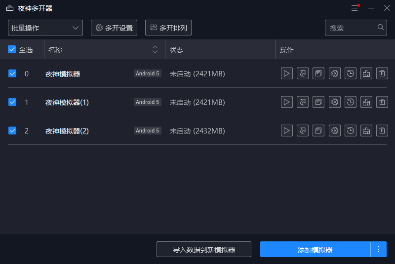
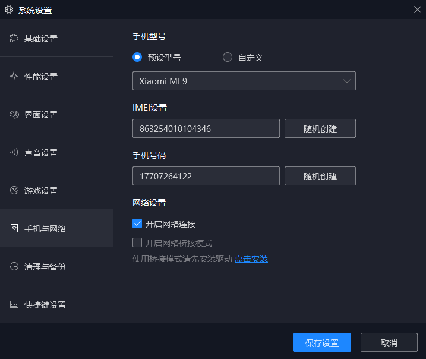
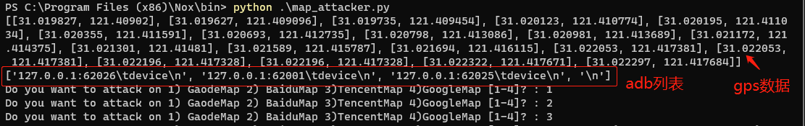
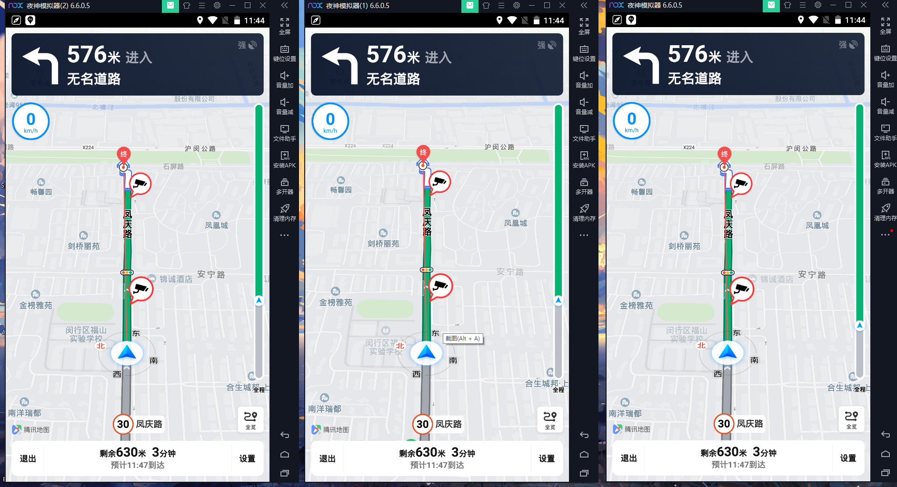

# map_attacker.py user's guidance

### Installation

- Python 3.x
- 夜神模拟器

### Step

1. 启动夜神模拟器，在模拟器中安装`高德地图，百度地图，腾讯地图，谷歌地图`（直接把`*.apk`拖到模拟器界面即可安装）。

   

2. 启动夜神多开器，复制2~5个模拟器（视计算机性能而定），并启动所有模拟器

   

3. 所有模拟器都打开后，打开每个模拟器的系统设置，随机创建IMEI和手机号，提高模拟成功率（可选步骤）

   

4. 把`map_attacker.py`文件移到夜神模拟器的安装`bin`目录下，e.g., `C:\Program Files (x86)\Nox\bin`，然后运行脚本，脚本会输出请求到的gps数据，以及模拟器的adb列表，如果adb列表为空，则需要重启下模拟器，然后再运行脚本

   

5. 按照脚本提示输入`1-4`选择地图应用开始模拟导航，地图应用第一次开启会比较慢，可能会导致脚本的模拟点击`开始导航`按钮不成功，这个时候可以手动点击一下开始导航，或者可以先把各个地图应用开启放在后台，就会开启比较快了

   